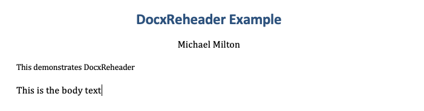

# Changing the .docx header in Quarto

Pandoc, and consequently Quarto do not have an easy mechanism for customizing the content of a docx file.
In particular, the document header is a function of the Quarto metadata, but it does not have an editable template, and is unaffected by the template document option that Quarto/Pandoc provide.

This repository presents a fairly simple way to customize the docx header, by first removing the default header and then subsequently allowing you to write a custom one.

## Instructions

To install the plugin, use:
```bash
quarto add multimeric/DocxReheader
```

Then, add it as a filter to your Quarto metadata:

```yml
format:
  docx:
    filters:
      - docx-reheader
```

Finally, you will need to add your header page manually.
To correctly style the header, I recommend using the following styles in your Quarto document. 
[As described here](https://pandoc.org/MANUAL.html#output), Quarto allows you to use the `custom-style` attribute to do this:

* `Title`
* `Abstract`
* `Author`

## Example

Let's say you have the following document:
```markdown
---
title: "DocxReheader Example"
abstract: "This demonstrates DocxReheader"
author:
  - name: Michael Milton
    phone: 0491 570 006
format: docx
---

This is the body text
```

When rendered to docx, this looks like:


Note that the title, author name and abstract are present, but not the phone number.
What if we wanted no abstract but to include the phone number?

In this case, we can follow the steps [outlined above](#instructions), to produce the final result: [example.qmd](example.qmd).
**Note**: not all metadata variables can currently be accessed due to https://github.com/quarto-dev/quarto-cli/issues/6769.

## Further reading
For more information about .docx conversion in Quarto, [refer to this helpful post](https://github.com/quarto-dev/quarto-cli/discussions/4511).
